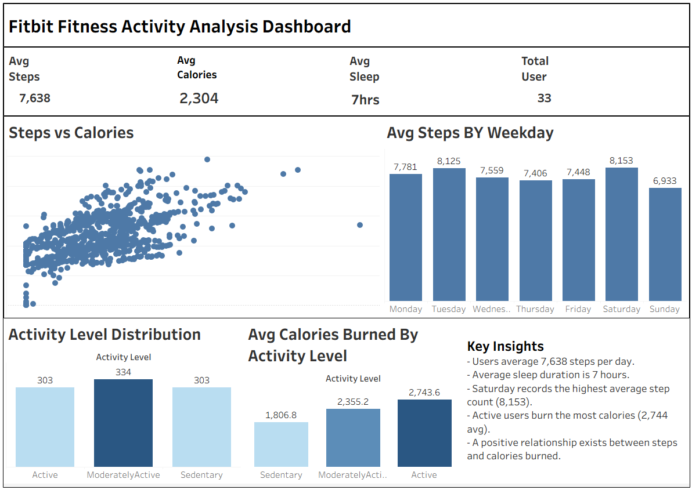

# 🏃 Fitbit Fitness Activity Analysis





> **Business Question:** How do Fitbit users engage with their fitness data — and what behavioral patterns can help improve user activity, sleep, and overall wellness?

---

## 📌 Project Overview

This project analyzes real-world Fitbit fitness tracker data from **33 users** across **940 daily activity records** to uncover patterns in physical activity, calorie expenditure, and sleep behavior. The goal is to identify actionable trends that can help a wellness brand improve user engagement and promote healthier lifestyles.

This project demonstrates end-to-end data analysis skills using **Excel for data cleaning** and **Tableau for interactive visualization**.

---

## 🛠️ Tools Used

| Tool | Purpose |
|------|---------|
| Microsoft Excel | Data cleaning, preparation, feature engineering |
| Tableau Public | Interactive dashboard and data visualization |
| GitHub | Project documentation and portfolio |


---


## 📂 Project Structure

```text
Fitbit-Fitness-Activity-Analysis
│
├── Data
│   ├── dailyActivity_clean.xlsx
│   └── sleepDay_clean.xlsx
│
├── Documentation
│   └── Fitbit_Documentation.txt
│
├── Dashboard
│   └── Fitbit_Dashboard.twbx
│
├── Images
│   └── dashboard.png
│
└── README.md
```

---

## ❓ Business Problem

Fitbit and similar wellness brands collect vast amounts of user activity data — but raw data alone doesn't drive engagement. The key question is:

**What patterns exist in user fitness behavior, and how can those patterns be used to design smarter, more personalized wellness experiences?**

By understanding when users are most active, how sleep relates to activity, and which user segments are underperforming, a wellness brand can design targeted interventions to improve health outcomes and increase app engagement.

---

## 🗃️ Dataset

- **Source:** [Fitbit Fitness Tracker Dataset — Kaggle](https://www.kaggle.com/datasets/arashnic/fitbit)
- **License:** CC0 — Public Domain
- **Period:** March 2016 – May 2016

| File | Records | Description |
|------|---------|-------------|
| dailyActivity_merged.csv | 940 | Steps, calories, activity minutes per day |
| sleepDay_merged.csv | 411 | Sleep duration and quality per night |
| **Total Users** | **33** | Unique Fitbit device users |

---

## 🧹 Data Cleaning & Preparation

All cleaning was performed in **Microsoft Excel**:

- Removed duplicate records across both datasets
- Checked and handled missing/null values
- Standardized date formats for consistent joining
- Created **Weekday** column to enable day-of-week analysis
- Created **Activity Level** column — categorized users as Active, Moderately Active, or Sedentary based on daily step count
- Created **Sleep Hours** column — converted sleep minutes to hours
- Created **Sleep Category** column — tagged users as Under-Sleeper, Normal, or Over-Sleeper based on 7–9 hour benchmark

---

## 📊 Dashboard KPIs

| Metric | Value |
|--------|-------|
| 👣 Average Daily Steps | 7,638 |
| 🔥 Average Calories Burned | 2,304 |
| 😴 Average Sleep Duration | 7 Hours |
| 👥 Total Users Analyzed | 33 |
| 📋 Total Activity Records | 940 |

🔗 **[View Full Interactive Dashboard on Tableau Public](https://public.tableau.com/views/fitbitfitnessanalysis/Dashboard1)**

---

## 📈 Visualizations

### 1️⃣ Steps vs Calories Burned
Scatter plot showing the positive correlation between daily steps and calories burned — users who walk more consistently burn more calories.

### 2️⃣ Average Steps by Weekday
Bar chart comparing average daily steps across each day of the week — reveals which days users are most and least active.

### 3️⃣ Activity Level Distribution
Pie/bar chart showing the breakdown of Active, Moderately Active, and Sedentary users across the dataset.

### 4️⃣ Average Calories Burned by Activity Level
Grouped bar chart comparing calorie expenditure across activity groups — highlights the gap between active and sedentary users.

---

## 🔍 Key Findings

### 🔵 Finding 1 — Users Fall Short of the Recommended Step Goal
- Users average **7,638 steps per day** — below the widely recommended 10,000 steps
- This gap represents a clear opportunity for engagement and nudge campaigns

### 🟢 Finding 2 — Sleep Duration is Healthy on Average
- Users average approximately **7 hours of sleep** per night
- However, a segment of users consistently falls below 6 hours — indicating a sleep-deprived sub-group worth targeting

### 🟡 Finding 3 — Steps and Calories are Strongly Correlated
- A clear positive relationship exists between step count and calorie burn
- Active users burn significantly more calories — confirming that step-based challenges directly impact health outcomes

### 🔴 Finding 4 — Sunday is the Least Active Day
- **Saturday** records the highest average step count across the week
- **Sunday** records the lowest — a consistent weekly dip that represents a targeted engagement opportunity

### 🟠 Finding 5 — Sedentary Users Dominate the Dataset
- A significant portion of users fall into the Sedentary category
- Sedentary users show the lowest calorie expenditure and are the highest-risk group for disengagement from the platform

---

## 💡 Recommendations

### 1. 🎯 Launch a "Close the Gap" Step Campaign
Users average 7,638 steps vs the 10,000 recommended. A personalized daily nudge notification showing users their gap ("You're 2,362 steps away from your goal") could meaningfully increase daily activity.

### 2. 📅 Target Sundays with Engagement Challenges
Sunday consistently records the lowest step counts. A weekly "Sunday Step Challenge" push notification — sent Saturday evening — could pre-motivate users before their least active day.

### 3. 🛌 Build a Sleep + Activity Correlation Feature
Data shows sleep and activity are linked. A feature that shows users "On days you sleep 7+ hours, you walk X% more steps" creates a compelling reason to track both metrics consistently.

### 4. 🚶 Create a Sedentary-to-Active Progression Program
The majority of users are sedentary. A structured 4-week step-up program starting at 5,000 steps and incrementally increasing targets could convert sedentary users into moderately active ones — the highest-value engagement shift.

### 5. 🏆 Reward Active Users to Retain Them
Active users already burn significantly more calories and engage more deeply. A loyalty tier or badge system rewards this behavior and reduces churn in the highest-value user segment.

---

## 🧠 Conclusion

This analysis of 33 Fitbit users reveals that while average sleep behavior is healthy, **daily step counts fall below recommended levels** and **sedentary behavior is widespread**. Sunday is a consistent low-activity day, and a strong correlation between steps and calories confirms that activity-based interventions have direct health impact.

By acting on these patterns — through personalized nudges, Sunday campaigns, and a sedentary-to-active progression program — a wellness brand can meaningfully improve both user health outcomes and platform engagement.

---

## 👤 About Me

I'm **Sadeep Dudekula**, a B.Tech (AIML) graduate and aspiring Data Analyst from India. This is part of my data analytics portfolio showcasing skills in Excel, Tableau, SQL, and Python.

🔗 [LinkedIn](https://www.linkedin.com/in/sadeep-dudekula-377911272?utm_source=share_via&utm_content=profile&utm_medium=member_android)

---

*Dataset sourced from Kaggle under CC0 Public Domain license. This project is for educational and portfolio purposes.*
